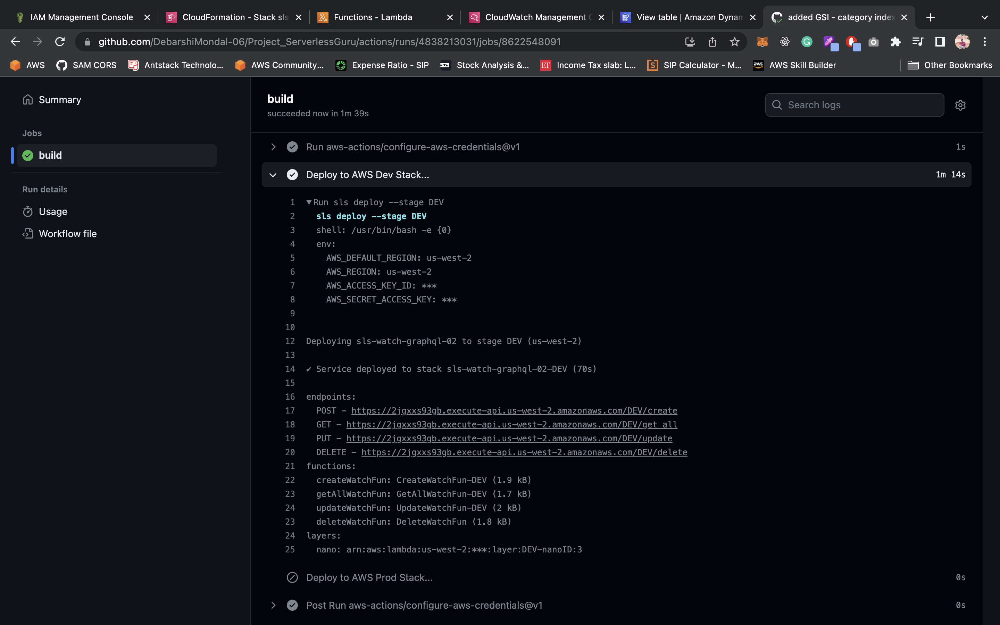
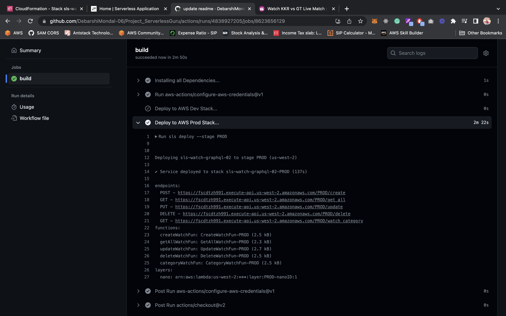

### Serverless Guru Task

##### Below are the Instructions provided to deploy your resources.


#### Step1:
Clone the Repo with,
```
  git clone https://github.com/DebarshiMondal-06/Project_ServerlessGuru.git
```

#### Step2:
If you haven't install serverless framework make sure to install it.
```
  npm install -g serverless
```

#### Step3:
Install the serverless framework plugins,
```
  npm install
```

#### Step4:
Deploy your resources, 
<b>Note: you can change the `stage` value with DEV or PROD. </b>
```
  sls deploy --stage DEV
```

Below showing CI/CD deployment for `DEV` stack.



##### Also, you can deploy your resources in PROD enviroment via, 
```
  sls deploy --stage PROD
```

Below showing CI/CD deployment for `PROD` stack.




<br />

##### Follow these steps run to the Frontend (Reactjs).
#### Step1:
Navigate to Frontend Folder and Install all the packages,
```
 cd Frontend & yarn install
```

#### Step2:
  Replace your API. Navigate to src/ContextGlobal.js

#### Step3:
Run to Start the application on your local.
  ```
    yarn start
  ```

<br/>

##### Technology Used:
- Serverless Framework
- API Gateway
- DynamoDB
- Lambda
- Nodejs
- VsCode
- Postman
